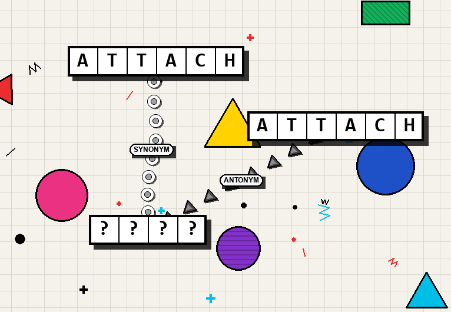

# WordFish

WordFish is a daily word puzzle game for the Reddit Devvit platform. Players are presented with a network of word-boxes and must deduce unknown words based on their semantic relationships (such as synonyms, anagrams, or hyponyms) to others.

### Gameplay
* **Objective:** Solve the puzzle by identifying all unknown words.
* **Interaction:** Players drag and arrange word-boxes on the screen. Connected words are linked by chains that reflect their semantic relationships.
* **Visual Style:** Features a Memphis design inspired, fun UI as shown below:
  

### Project Goals
* **MVP:** A functional daily word puzzle delivered via the Reddit Devvit platform.
* **Stretch Goals:**
    * Support for community-generated puzzles.
    * Multiple difficulty levels (e.g., Easy and Hard modes).
    * Comprehensive, intuitive tutorial.
    * High-polish UI/UX and visual feedback.

### Built With
* [Phaser](https://phaser.io/)
* [Devvit](https://developers.reddit.com/)